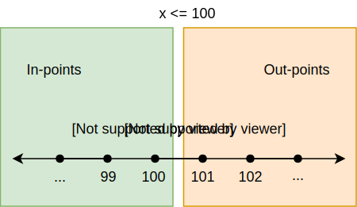
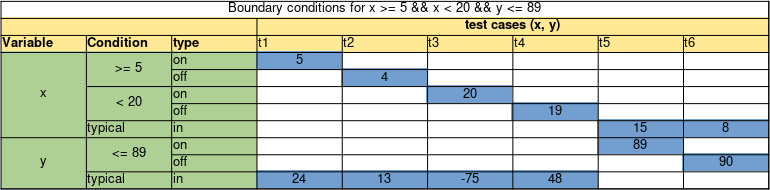
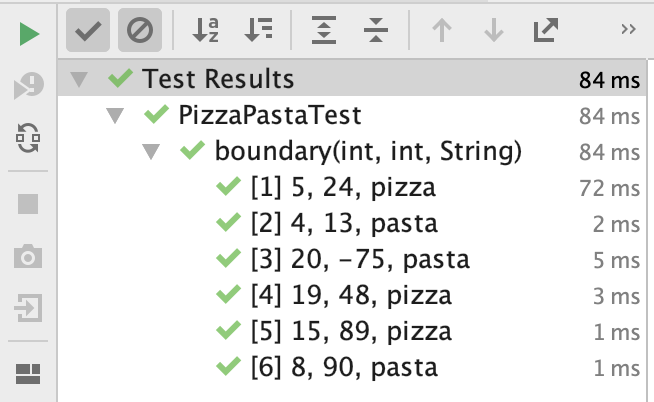

# Boundary testing

Off-by-one mistakes are a common cause for bugs in software systems.
As developers, we have all made mistakes such as using a > where it had to be a >=. 
Interestingly, programs with such a bug tend to work well for most of the provided inputs;
it fails, however, when the input is "near the boundary of condition".

In this chapter, we explore **boundary testing** techniques
often occur because of the lack of boundary testing.

## Boundaries in between classes/partitions

In the previous chapter, we studied specification-based techniques and, more specifically,
we understood the concept of classes/partitions.
When we devise classes, these have "close boundaries"
with the other classes. 
In other words, if we keep performing small changes 
to an input that belongs to some partition (e.g., by adding +1 to it), 
at some point this input will now belong to another class. 
The precise point where the input changes from one class to another is what we call a *boundary*.
And this is precisely what boundary testing is about: to make the program behaves correctly
when inputs are near a boundary.

More formally,
we can find such boundaries by finding a pair of consecutive 
input values $$[p_1,p_2]$$, where $$p_1$$ belongs to partition A, and $$p_2$$ belongs to partition B.

Let us apply boundary testing in a concrete example:

> **Requirement: Calculating the amount of points of the player**
> 
> Given the score of the player and the remaining life of the player, we program returns:
> - If the player's score is below 50, then it always adds 50 points on top of the current points.
> - If the player's score is greater than or equals to 50, then:
>   - if remaining life is greater than or equal to 3 lives: triple the score of the player
>   - otherwise, add 30 points on top of the current points.

A possible implementation for this method can be:

```java
public class PlayerPoints {

  public int totalPoints(int currentPoints, int remainingLives) {
    if(currentPoints < 50)
      return currentPoints+50;

    return remainingLives < 3 ? currentPoints+30 : currentPoints*3;
  }
}
```

When devising the partitions to test this method, a tester might come up with the following partitions:

1. **Less points**: Score < 50
2. **Many points but little lives**: Score >= 50 and remaining life < 3
3. **Many points and many lives**: Score >= 50 and remaining life >= 3

Those partitions would lead testers to devise at least three test cases, one per partition:

```java
public class PlayerPointsTest {

  private final PlayerPoints pp = new PlayerPoints();

  @Test
  void lessPoints() {
    assertEquals(30+50, pp.totalPoints(30, 5));
  }

  @Test
  void manyPointsButLittleLives() {
    assertEquals(300+30, pp.totalPoints(300, 1));
  }

  @Test
  void manyPointsAndManyLives() {
    assertEquals(500*3, pp.totalPoints(500, 10));
  }
}
```

However, a tester aware of boundaries, also devise test cases that explore
the boundaries of the domain.
Let us explore them: 

* **Boundary 1:** When the score is strictly smaller than 50, it belongs to partition 1.
If the score is greater than or equals to 50, it belongs to partitions 2 and 3.
Therefore, we observe the following boundary: when the scores changes from 49 to 50,
the partition it belongs to also changes (let us call this test B1).

* **Boundary 2:** Given a score that is greater than or equal to 50, we observe that if
remaining life is smaller than 3, it belongs to partition 2; otherwise, it belongs
to partition 3. Thus, we just identified another boundary there (let us call this test B2).

We can visualize these partitions with their boundaries in a diagram.


In our example, the tester would then 
devise and automate test cases B1 and B2. Given that a boundary is composed of two different input values, note that
each boundary will require *at least* two test cases:

For B1:
* B1.1 = input={score=49, remaining life=5}, output={99}
* B1.2 = input={score=50, remaining life=5}, output={100}

For B2:
* B2.1 = input={score 500, remaining life=3}, output={200}
* B2.2 = input={score 500, remaining life=2}, output={130}

In JUnit code (and note how we wrote the two test cases for a boundary in a single test (and not splitting it into two
test methods). That makes the test more cohesive; if
if find a boundary bug, a single test will let us know):

```java
@Test
void betweenLessAndManyPoints() {
  assertEquals(49+50, pp.totalPoints(49, 5));
  assertEquals(50*3, pp.totalPoints(50, 5));
}

@Test
void betweenLessAndManyLives() {
  assertEquals(500*3, pp.totalPoints(500, 3));
  assertEquals(500+30, pp.totalPoints(500, 2));
}
```



You might have noticed that, for B1, in case of score < 50, `remaining life` makes no difference.
However, for score >= 50, remaining life makes a difference, as the output can vary, according to it. 
And for the B1.2 test case, we chose remaining life = 5, which makes the
condition true. 
You might be questioning yourself whether you also need to devise another test case, B1.3, where the remaining life
condition would be exercised now as false. 

As a tester, if you are looking for testing all possible combinations, then the answer is yes. However, in longer
conditions, full of boundaries, the amount of combinations might be too high, making it unfeasible for the developer
to test them all. Later in this chapter, we will learn
how to choose values for the "boundaries that we do not care".



## On and off points

Given some initial intuition on how to analyze boundaries, let us define some
terminology:

- **On-point:** The on-point is the value that is exactly on the boundary. This is the value we see in the condition itself. 
- **Off-point**: The off-point is the value that is closest to the boundary and that flips the conditions. If the on-point makes the condition true, the off point makes it false and vice versa. Note that when dealing with equalities or non equalities (e.g. $$x == 6$$ or $$x != 6$$), there are two off-points; one in each direction.
- **In-points**: In-points are all the values that make the condition true.
- **Out-points**: Out-points are all the values that make the condition false.

**Example:** Suppose we have a program that adds shipping costs when the total price is below 100.
The condition used in the program is $$x < 100$$.

* The on-point is $$100$$, as that is the value that is precisely in the condition.
* The on-point makes the condition false (100 is not smaller than 100), so the off-point should be the closest number that makes the condition true.
This will be $$99$$, as $$99 < 100$$ is true.
* The in-points are the values which are smaller than or equal to $$99$$. For example, 37, 42, 56.
* The out-points are all values which are larger than or equal to $$100$$. For example, 325, 1254, 101.

We show all these points in the diagram below.


Let us now study a similar but slightly different condition: $$x <= 100$$ (note how similar they are; the only difference is that, in this one, we use smaller than or equals to):

- The on-point is still $$100$$: this is the value that is precisely in the condition.
- The condition is evaluated as true for the on-point. So, the off-point should be the closest number to the on-point, but making the condition false. The off-point is thus $$101$$.



Note that, depending on the condition, an on-point can be either an in- or an out-point.

As a tester, you devise test cases for these different points: a test case for the 
on-point, a test case for the off-point, a test case for a single in-point (as all in-points
belong to the same equivalent partition), and a test case for a single out-point (as all
out-points also belong to the same equivalent partition).

## Deriving tests for multiple conditions

In the previous example, we looked at one condition and its boundary.
However, in most programs you will find statements that consist of multiple conditions,
e.g., `a > 10 && b < 20 && c == 10 && d >= 50`. (Note that these conditions might be
expressed in a single `if` statement, but also spread all other a method or a class; it
is up to the tester to identify how these different conditions interact with each other).

In such cases, the number of boundary tests might explode. Imagine a program composed
of 5 different conditions. If we decide to write 4 test cases (on, off, in, out points) for 
each of the conditions, and make sure we test all the possible combinations among them,
we end up with $$5^4=625$$ tests. This is simply too much.

To effectively test the boundaries in these more complicated decisions, while
minimizing the amount of required tests,
we can use the **simplified domain testing strategy**, proposed by Jeng and Weyuker.
The idea of this strategy is to test each boundary separately, i.e. independent of the other conditions.

To do so, **for each boundary**:

* We pick the on- and off-point and we create one test case for each of these two points.
* As we want to test each boundary independently, we choose in-points for the other variables/conditions. Note that we always choose in points, regardless
of the boolean expression being connected by means of ANDs or ORs. In practice, we want all the other conditions to return true, so that
we can evaluate the outcome of the condition under test independently.
* It is important to vary the chosen in-points in the different tests, and to not choose the on- or off-point.
This gives us the ability to partially check that the program gives the correct results for some in-points.
If we would set the in-point to the on- or off-point, we would be testing two boundaries at once.

To find these values and display the test cases in a structured manner, we use a **domain matrix**.
In general, the table looks like the following:


In this template, we have two conditions with two parameters (see the $$x > a \land y > b$$ condition).
We list the variables, with all their conditions.
Each condition has two rows: one for the on-point and one for the off-point.
Each variable has an additional row for the typical (in-) values.
These are used when testing the other boundary.

Each column that corresponds to a test case has two colored cells.
In the colored cells you have to fill in the correct values.
Each of these pairs of values will then give a test case.
If we implement all the test cases that the domain matrix gives us, 
we exerise each boundary both for the on- and off-point independent of the other parameters.

Let us walk through another example:

> **Requirement**: Pizza or pasta
>
> The program decides whether a person should eat pizza or pasta.
> Given two random numbers, x and y, if x is in between $$[5,20[$$
> and y is smaller than or equal to 89, the program returns "pizza".
> Otherwise it returns "pasta". 

A simple implementation of this program would be:

```java
public String pizzaOrPasta(int x, int y) {
  return (x >= 5 && x < 20 && y <= 89) ?
    "pizza" :
    "pasta";
}
```

If we derive test cases based on the specification, we end up with at least two partitions:

* **Pizza**: the program returns pizza. T1={x=15, y=50}.
* **Pasta**: the program returns pasta. T2={x=15, y=100}.

(Now that you are more experienced in testing, you can probably see that these
two partitions are not enough.)

```java
public class PizzaPastaTest {

  private final PizzaPasta pp = new PizzaPasta();

  @Test
  void pizza() {
    assertEquals("pizza", pp.pizzaOrPasta(15, 50));
  }

  @Test
  void pasta() {
    assertEquals("pasta", pp.pizzaOrPasta(15, 100));
  }
}
```

Let us now apply boundary testing. Note how easy it is for a developer to
make a mistake, e.g., confusing $$x >= 5$$ with a $$x > 5$$.

We start by making the domain matrix, having space for each of the conditions and both parameters.


Given that the statement has three conditions, we therefore will devise
$$2 \times 3 = 6$$ tests.
If we fill the table with the on-, off-, and typical random in points, we end up
with the following tests:



Now we have derived the six test cases that we can use to test the boundaries:

* T1={x=5, y=24}, output=pizza
* T2={x=4, y=13}, output=pasta
* T3={x=20, y=-75}, output=pasta
* T4={x=19, y=48}, output=pizza
* T5={x=15, y=89}, output=pizza
* T6={x=8, y=90}, output=pasta

```java
@Test
void boundary_x1() {
  assertEquals("pizza", pp.pizzaOrPasta(5, 24));
  assertEquals("pasta", pp.pizzaOrPasta(4, 13));
}

@Test
void boundary_x2() {
  assertEquals("pasta", pp.pizzaOrPasta(20, -75));
  assertEquals("pizza", pp.pizzaOrPasta(19, 48));
}

@Test
void boundary_y() {
  assertEquals("pizza", pp.pizzaOrPasta(15, 89));
  assertEquals("pasta", pp.pizzaOrPasta(8, 90));
}
```





## Boundaries that are not so explicit

Let's revisit the example from the a previous chapter. There, we had a program
where the goal was to return the amount of bars needed in order to build some boxes of chocolates:


> **Chocolate bars**
> 
> A package should store a total number of kilos. 
> There are small bars (1 kilo each) and big bars (5 kilos each). 
> We should calculate the number of small bars to use, 
> assuming we always use big bars before small bars. Return -1 if it can't be done.
>
> The input of the program is thus the number of small bars, the number of big bars,
> and the total amount of kilos to store.

And these were the classes we derived after applying the category/partition method:

* **Need only small bars**. A solution that only uses the provided small bars.
* **Need only big bars**. A solution that only uses the provided big bars.
* **Need Small + big bars**. A solution that has to use both small and big bars.
* **Not enough bars**. A case in which it's not possible, because there are not enough bars.
* **Not from the specs**: An exceptional case.

A developer implemented the following code for the requirement, and all the tests pass.

```java
public class ChocolateBars {
    public static final int CANNOT_PACK_BAG = -1;

    public int calculate(int small, int big, int total) {
        int maxBigBoxes = total / 5;
        int bigBoxesWeCanUse = Math.min(maxBigBoxes, big);
        total -= (bigBoxesWeCanUse * 5);

        if(small <= total)
            return CANNOT_PACK_BAG;
        return total;
    }
}
```

However, another developer tried `(2,3,17)` as an input and the program crashed. After some debugging,
they noticed that the if statement should had been `if(small < total)` instead of
`if(small <= total)`. This smells like a bug that could had been found via boundary testing.

```java
public class ChocolateBars {
    public static final int CANNOT_PACK_BAG = -1;

    public int calculate(int small, int big, int total) {
        int maxBigBoxes = total / 5;
        int bigBoxesWeCanUse = Math.min(maxBigBoxes, big);
        total -= (bigBoxesWeCanUse * 5);

        // we fixed the bug here!
        if(small < total)
            return CANNOT_PACK_BAG;
        return total;
    }
}
```

Note that the test `(2,3,17)` belongs to the **need small + big bars** partition. In this case,
the program will make use of all the big bars (there are 3 available) and then *all* the small bars available (there are 
2 available). Note that the buggy program would work if we had 3 available small bars (having `(3, 3, 17)` as input).
This is a boundary that is just a bit less explicit from the requirements.


As we defined at the beginning of this chapter,
boundaries also happen when we are going from "one partition" to 
another. There is a "single condition" that we can use as clear source.
In these cases, what we should do is to devise test cases for a sequence of inputs that move
from one partition to another.

Let us focus on the bug caused by the `(2,3,17)` input:

* `(1,3,17)` should return *not possible* (1 small bar is not enough). This test case belongs to the **not enough bars** partition.
* `(2,3,17)` should return 2. This test case belongs to **need for small + big bars** partition.

There is a boundary between the `(1,3,17)` and the `(2,3,17)`. We should make sure the software still behaves correctly in these cases.

Looking at the **only big bars** partition, we should find inputs that transition from this
partition to another one:

* `(10, 1, 10)` returns 5. This input belongs to the **need small + big bars** partition.
* `(10, 2, 10)` returns 0. This input belongs to the **need only big bars** partition.

Finally, with the **only small bars** partition:

* `(3, 2, 3)` returns 3. We need only small bars here, and therefore, this input belongs to the **only small bars** partition.
* `(2, 2, 3)` returns -1. We can't make the boxes. This input belongs to the **Not enough bars** partition.

A partition might make boundaries with more than just one single another partitions. 
The **only small bars** partition has boundaries not only with the **not enough bars** partition (as we saw above), but also with the **only big bars** partition:

* `(4, 2, 4)` returns 4. We need only small bars here, and therefore, this input belongs to the **only small bars** partition.
* `(4, 2, 5)` returns 0. We need only bigs bars here, and therefore, this input belongs to the **only big bars** partition.

A lesson we learn from this example is that boundary bugs may not 
only emerge out of "clear if conditions" we
see in the implementation. Boundary bugs also happen in more subtle
interactions among partitions.





## Automating boundary testing with JUnit (via Parameterized Tests)

You might have noticed that in the domain matrix we always have a certain amount of input values and, implicitly, an expected output value.
We could just implement the boundary tests by making a separate method for each test, or by
grouping them per boundary, as we have been doing so far.

However, the amount of test methods can quickly become large and unmanageable.
Moreoever, the code in these test methods will be largely the same,
as they all have the same structure, only with different input and output values.

Luckily, JUnit offers a solution where we can generalize the implementation of a test
method, and run it different inputs and outputs: **Parameterized Tests**.
As the name suggests, with a parameterized test, developers 
can define a test method with parameters.
To define a parameterized test, you make use of the `@ParameterizedTest` annotation, 
instead of the usual `@Test` annotation.

For each parameter you want to pass to the "template test method", you define a 
parameter in the method's parameter list (note that so far, all our JUnit methods had
no parameters). For example, a test method `t1(int a, int b)` receives two parameters,
`int a`, and `int b`. The developer uses these two variables in the body of the test
method, often in places where the developer would have a hard-coded value.

The next step is to feed JUnit with a list of inputs which it will pass
to the test method.
In general, these values are provided by a `Source`.
Here, we will make use of a `CsvSource`.
With it, each test case is given as a comma-separated list of input values.
To execute multiple tests with the same test method, 
the `CsvSource` expects list of strings, where each string represents 
the input and output values for one test case.
The `CsvSource` is an annotation itself, so in an implementation 
it would like like the following: `@CsvSource({"value11, value12", "value21, value22", "value31, value32", ...})`


Let us implement the boundary test cases that we derived in the _Pizza or Pasta_ example, using the parameterized test.


To automate the tests we create a test method with three parameters: `x`, `y`, `expectedResult`.
`x` and `y` are integers.
The `expectedResult` is a String, containing the expected output, _pasta_ or _pizza_.

```java
@ParameterizedTest
@CsvSource({
    "5, 24, pizza",
    "4, 13, pasta",
    "20, -75, pasta",
    "19, 48, pizza",
    "15, 89, pizza",
    "8, 90, pasta"
})
void boundary(int x, int y, String expectedResult) {
  assertEquals(expectedResult, pp.pizzaOrPasta(x, y));
}
```

The behavior
of this single test method is the same as the six test methods we declared before. However, now
with a much smaller amount of code.

JUnit will run the `boundary` test six times: one for each line in the `@CsvSource`. 
In your IDE, you might even see JUnit showing each of the test cases being executed:




JUnit's Parameterized tests have more functionalities and ways of providing input data.
We point the reader to JUnit's manual.






## The CORRECT way

The *Pragmatic Unit Testing in Java 8 with JUnit*, by Langr, Hunt, and Thomas, has an interesting discussion about boundary conditions.
Authors call it the **CORRECT** way, as each letter represents one boundary condition to consider:

* **Conformance:**
  * Many data elements must conform to a specific format. Example: e-mail (always name@domain). If you expect an e-mail, and you do not
  receive an e-mail, your software might crash.
  * Required action: test when your input is not in conformance with what is expected.

* **Ordering:**
  * Some inputs might come in specific orders. Imagine a system that receives different products to be inserted in a basket. The order of the data might influence the output. What happens if the list is ordered? Unordered?
  * Required action: Make sure our program works even if the data comes in an unordered manner (or return an elegant failure to user, avoiding the crash).

* **Range:**
  * Inputs should usually be within a certain range. Example: Age should always be greater than 0 and smaller than 120.
  * Required action: Test what happens when we provide inputs that are outside of the expected range.

* **Reference:**
  * In OOP systems, objects refer to other objects. Sometimes the relationships between the objects are extensive and there may be external dependencies. What happens if these dependencies do not behave as expected?
  * Required action: When testing a method, consider:
    * What it references outside its scope
    * What external dependencies it has
    * Whether it depends on the object being in a certain state
    * Any other conditions that must exist

* **Existence:**
  * Does "something" really exist? What if it does not? Imagine you query a database, and your database returns empty. Will our software behave correctly?
  * Required action: Does the system behave correctly when something that is expected to exist, does not?


* **Cardinality:**
  * In simple words, our loop performed one step less (or more) than it should.
  * Required action: Test loops in different situations, such as when it actually performs zero iterations,
  one iterations, or many. (Loops are further discussed in the structural-based testing chapter).

* **Time**
  * Systems rely on dates and times. What happens if the system receives inputs that are not
  ordered in regards to date and time?
  * Timeouts: Does the system handle timeouts well?
  * Concurrency: Does the system handle concurrency well?










## Exercises

**Exercise 1.**
We have the following method.

```java
public String sameEnds(String string) {
  int length = string.length();
  int half = length / 2;

  String left = "";
  String right = "";

  int size = 0;
  for(int i = 0; i < half; i++) {
    left += string.charAt(i);
    right = string.charAt(length - 1 - i) + right;

    if (left.equals(right))
      size = left.length();
  }

  return string.substring(0, size);
}
```

Perform boundary analysis on the condition in the for-loop: `i < half`, i.e. what are the on- and off-point and the in- and out-points?
You can give the points in terms of the variables used in the method.


**Exercise 2.**
Perform boundary analysis on the following decision: `n % 3 == 0 && n % 5 == 0`.
What are the on- and off-points?


**Exercise 3.**
A game has the following condition: `numberOfPoints <= 570`.
Perform boundary analysis on the condition.
What are the on- and off-point of the condition?
Also give an example for both an in-point and an out-point.


**Exercise 4.**
We extend the game with a more complicated condition: `(numberOfPoints <= 570 && numberOfLives > 10) || energyLevel == 5`.

Perform boundary analysis on this condition.
What is the resulting domain matrix?


**Exercise 5.**
Regarding **boundary analysis of inequalities** (e.g., `a < 10`), which of the following statements **is true**?

1. There can only be a single on-point which always makes the condition true.
2. There can be multiple on-points for a given condition which may or may not make the condition true.
3. There can only be a single off-point which may or may not make the condition false.
4. There can be multiple off-points for a given condition which always make the condition false.


**Exercise 6.**
A game has the following condition: `numberOfPoints > 1024`. Perform a boundary analysis.


**Exercise 7.**
Which one of the following statements about the **CORRECT** principles is **true**?

1. We assume that external dependencies are already on the right state for the test (REFERENCE).
1. We test different methods from the same class in an isolated way in order to avoid order issues (TIME).
1. Whenever we encounter a loop, we always test whether the program works for 0, 1, and 10 iterations (CARDINALITY).
1. We always test the behavior of our program when any expected data does not exist (EXISTENCE).


## References

* Jeng, B., & Weyuker, E. J. (1994). A simplified domain-testing strategy. ACM Transactions on Software Engineering and Methodology (TOSEM), 3(3), 254-270.

* Chapter 7 of Pragmatic Unit Testing in Java 8 with Junit. Langr, Hunt, and Thomas. Pragmatic Programmers, 2015.


